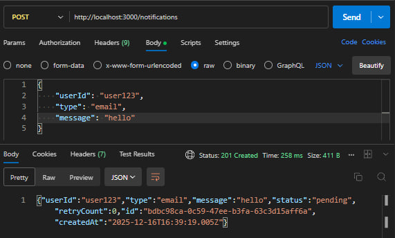
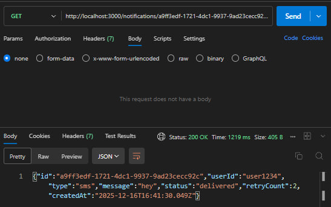
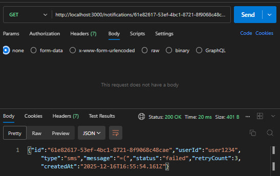

# Notification Dispatcher

Микросервис для распределения уведомлений с гарантированной доставкой и автоматическими повторными попытками.

## Архитектура

##### Слои архитектуры (Clean Architecture)

Presentation Layer (Controllers):

- `NotificationController` - REST API endpoints
- Валидация входных данных через DTO

Business Logic Layer (Services):

- `NotificationService` - бизнес-логика
- Обработка статусов и взаимодействие с другими слоями

Data Access Layer (Repositories):

- `NotificationRepository` - работа с БД
- Абстракция над TypeORM

Infrastructure Layer:

- `NatsService` - работа с очередью сообщений
- `RedisService` - кеширование ACK
- `NotificationWorker` - фоновая обработка

## Установка и запуск

- требования: docker & docker compose, node.js 20+ (для локальной сборки)

###

#### Запуск через Docker compose:

```bash
git clone https://github.com/damirtag/notification-dispatcher-avrora.git
cd task-processor

# запуск всех сервисов
docker-compose up -d

# проверка логов
docker-compose logs -f api

# остановка
docker-compose down
```

## Принцип работы

#### Создание уведомления

1. Клиент отправляет POST запрос с данными уведомления
2. Controller валидирует DTO
3. Service создает запись в БД со статусом pending
4. Service публикует событие в NATS subject notifications
5. Клиент получает созданное уведомление

#### Обработка уведомления (Worker)

1. Worker получает событие из NATS
2. Меняет статус на processing в БД
3. Симулирует доставку (задержка 1-2 секунды)

_Успех:_

1. Записывает ACK в Redis (TTL 5 минут)
2. Обновляет статус на delivered в БД

_Неудача:_

1. Проверяет счетчик попыток
2. Если < 3: публикует событие заново с задержкой 5 секунд
3. Если >= 3: меняет статус на failed в БД

## Примеры запросов

- _POST /notifications_

```json
{
  "userId": "string",
  "type": "string",
  "message": "string"
}
```



- _GET /notifications/{id}/status_



- При неудаче (более 3 попыток) статус переходит в `failed`


